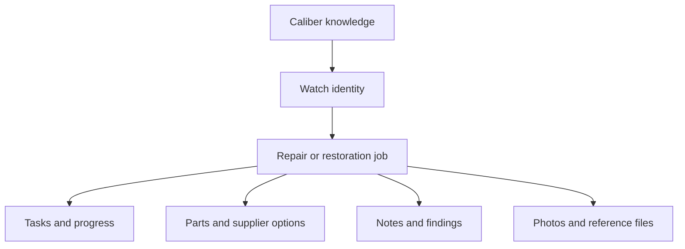
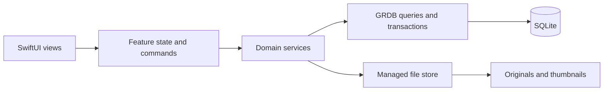

# Watch workshop app specification

Version 0.5. Updated on 2 October 2026. This is the first-release contract for review. The current-platform direction, app foundation, and W002 SQLite/GRDB storage design were approved on 1 October 2026. The user approved the shared caliber design on 2 October 2026. Explicit Save and Cancel editing is approved for W003 and W004. Other proposed defaults are not yet an approved product baseline. Job history remains proposed. PDF report creation is deferred. Parts must accept saved links.

Build a native Mac app that keeps a watch's identity, repair work, and supporting evidence together. A watch is a lasting record. A job is one repair or restoration of that watch. A caliber is reusable technical knowledge. All app data stays on the Mac. The user chooses when to open an external link or export a file.

## 1 Product decisions

### Confirmed requirements

- Store watch names, calibers, and other specifications.
- Store technical sheet links, research, and photos.
- Plan work with tasks and visible progress.
- Record the watch's state.
- Track required parts with descriptions, reference numbers, one or more optional saved links, and purchase states. Links can point to product listings, suppliers, or identification references.
- Support overview, active bench work, and records that can help a customer.
- Build a native macOS app with local storage first.
- Leave a practical route to cloud sync later.
- Divide implementation into small issues that agents can deliver as separate PRs.

### Approved platform direction

- Target macOS 27 and Apple silicon. Older macOS releases and Intel Macs are outside the target.
- Use Xcode 27, the macOS 27 SDK, and Swift 6.4 in Swift 6 language mode.
- Use SwiftUI Observation, native navigation and controls, complete concurrency checks, approachable concurrency, and main-actor isolation by default. Move database, file, and image work off the main actor.
- Use Ure as the working app name. The local bundle identifier is local.ure.app; settle an owner-controlled identifier before distribution and before storing valuable data.
- Measure performance with optimized builds and realistic datasets. New technology alone is not evidence that the app meets its performance targets.

### Proposed defaults

These choices make the draft concrete. They are recommendations, not user approvals.

| Decision | Proposed first version |
| --- | --- |
| Repair history | Several jobs per watch; at most one open job per watch |
| Customers | Optional name, email, and phone on the job; work notes and outcomes for later reference |
| Shared knowledge | Approved on 2 October 2026: reusable caliber records linked to several watches; notes, photos, PDF files, and links follow in their own issues |
| Native stack | Approved: Swift 6 and SwiftUI Observation; AppKit and PDFKit where needed |
| Persistence | Approved: SQLite through GRDB; photos and PDFs in app-managed files |
| Minimum system | Approved: macOS 27 on Apple silicon; no older-system compatibility layer |
| Distribution | Run locally from Xcode first; store distribution and automatic updates are later work |
| Editing | Approved for W003 and W004: explicit Save and Cancel, Cmd-S, and unsaved-draft protection; later notes and immediate status actions remain proposed |
| Notes | Plain text with selectable and clickable links; no rich text editor |
| Measurements | Written notes and attached instrument photos in version 1; structured measurement forms later |
| Parts cost | Optional supplier price and currency; no job accounting or invoice totals |
| Naming | Ure is the working title; distribution identity remains to be settled |

If separate jobs are rejected, revise the model and backlog before implementation. If shared caliber knowledge changes, revise its dependent issues before implementation. Do not build both alternatives.

### Outside the first release

PDF report creation and export, accounts, cloud services, device sync, mobile clients, collaboration, billing, quotes, invoices, automatic supplier ordering, stock control, AI identification, OCR, website scraping, image annotation, time tracking, recurring reminders, repair templates, structured test instruments, and importing other apps' databases are outside this release. These features have no placeholder UI.

## 2 Mental model

The arrow from caliber to watch means that the watch can refer to a caliber. A caliber can serve several watches. Files and notes can belong to a caliber, a watch, or a job. The UI labels this scope. It never silently copies shared knowledge into a job.

Separate three meanings of state:

| Indicator | Question it answers | Example |
| --- | --- | --- |
| Job stage | Where is this repair in the workflow? | Waiting |
| Watch condition | What is the watch like now? | Disassembled |
| Task progress | How many planned tasks are done? | 6 of 10 done |

Changing one does not change the others. A task count is not an estimate of remaining effort.

## 3 Main user journeys

### Add a watch and start work

Create a watch with a name only. All other specifications can remain unknown. Add the brand, model, case reference, serial number, and caliber when evidence is available. Create a job with a title and an intake description. Add the reported fault, the planned scope, optional owner details, and initial photos. The job copies the known identity and caliber label into an intake snapshot.

### Plan and source

Add tasks in the order they will be done. Group them under optional stage labels such as Inspection, Disassembly, Cleaning, Assembly, and Testing. These are user-entered labels. Add required parts and compare supplier links. Keep the manufacturer's part reference separate from each supplier's stock code. Mark uncertain compatibility explicitly. Link a task to a required part when that part holds up the task.

### Work at the bench

Open a job. Keep the task list visible beside a pinned photo or technical PDF. Zoom and pan a photo. Move between photos with the keyboard. Read a PDF without leaving the app. Add dated notes and record findings as the work develops. Save partial knowledge without inventing missing specifications.

### Pause and resume

Set a job to Waiting and give a reason. The workshop overview shows that reason, unfinished tasks, and parts still required. Return later and open the same job and reference item. Restarting the app retains saved content and the last selected job. Window size and reference selection are preferences, not repair history.

### Finish and retain history

Record the outcome, work performed, and recommendations. Review unfinished tasks and unresolved parts before completion. Keep these records available for later customer questions. A later repair creates a new job for the same watch. Earlier job snapshots remain unchanged. Report creation can be added in a later release.

## 4 Screens and interaction

Use standard macOS controls, system typography, native menus, keyboard focus, and system light and dark appearances. Do not build a browser-style administration dashboard.

### Main window

The sidebar contains Workshop, Watches, Calibers, Parts, and Archive. Settings is in the app menu. A middle list shows the selected section's records. The detail area shows the selected record. A search field filters the current section. A separate global search action returns grouped results.

At a proposed minimum window size of 1000 by 650 points, show the list and detail without clipped controls. The optional reference pane can collapse. At larger widths it can sit beside tasks or notes. The app has one main editing window in version 1. A reference window may be opened read-only.

### Workshop

Show open jobs grouped by Planned, In progress, Waiting, and Ready. Each row has a watch thumbnail, watch and job names, stage, task count, waiting reason, and unresolved part count. Filters support stage and text. Default order is most recently updated. Completed and cancelled jobs are available through watch history and Archive.

### Watch detail

Show identity, specifications, current condition, watch-level notes and references, and job history. A primary action creates a job or opens the existing open job. The app does not automatically create a second open job.

### Job detail

The header shows watch identity, job stage, watch condition, and task progress. Sections are Overview, Tasks, Parts, Notes, Photos, and References. Overview shows intake, outcome, owner details, and the activity timeline. The reference pane can display a job, watch, or caliber item while another section remains open.

### Parts overview

Show parts from open jobs. Filter by Needed, Ordered, Arrived, Installed, or Cancelled. Each row names its job and watch. An action opens that part's job. Supplier websites open in the default browser only after a user action.

### Caliber detail

Show manufacturer, exact designation and variant, structured specifications, notes, and reference items. Watches that refer to the caliber are visible. Editing shared content affects future viewing from those watches. It does not rewrite job intake snapshots.

### Save and failure behavior

Forms and note editors show Save and Cancel. Cmd-S saves the active editor. Navigation, window closure, and app termination with an unsaved draft offer Save, Discard, or Stay. A failed save keeps the draft and shows a useful error. Buttons become disabled during their own pending operation. A success state appears only after persistence succeeds. Simple actions such as completing a task save immediately. Failure leaves or restores the previous visible state.

## 5 Records and validation

All durable records use application-generated UUIDs. Created and updated times are UTC instants. Display dates use the user's system locale. Model references, serial numbers, and part numbers are text. Preserve their punctuation and leading zeros. Optional values remain absent rather than using zero or a made-up value.

Use explicit SQL foreign keys. Enable foreign key enforcement on every database connection. Enforce local uniqueness only for internal IDs and defined compound keys. Two watches may legitimately share a name, model, or serial text. The app can warn about possible duplicates without blocking them.

### Watch

Required: ID and display name. Optional: brand, model, case reference, serial, approximate year as text, caliber ID, case material, case diameter in millimetres, lug width in millimetres, stated water resistance as text, and free-form specification notes. Numeric dimensions must be finite and positive. A stated water resistance is a specification, not proof of a current pressure test.

Current condition is Unknown, Running, Running poorly, Stopped, or Disassembled. Add an optional condition note. Store a cover photo by reference to a photo item belonging to this watch or one of its jobs. Removing that photo clears the cover reference. Archived watches remain searchable when archive results are enabled.

### Caliber

Required: display designation. Optional: manufacturer, variant, movement type, beat rate in vibrations per hour, jewel count, nominal power reserve in hours, lift angle in degrees, specification notes, and a source note. Movement type is Unknown, Manual, Automatic, Quartz, or Other. Numeric fields are optional, finite, and non-negative; nonzero is required for beat rate and lift angle. Add a source note or reference for technical claims. Do not seed unverified technical data.

### Job

Required: watch ID and title. Optional: reported problem, agreed scope, intake condition text, outcome text, recommendations, owner name, email, phone, and a waiting reason. Email and phone are free text because this release never sends messages. Intake stores a JSON snapshot of the watch name, brand, model, case reference, serial, and caliber designation and variant. Its schema has an explicit version. It can be corrected while the job is open. Editing the watch does not change this snapshot.

Only one job whose stage is Planned, In progress, Waiting, or Ready can exist for a watch. Enforce this rule in both the service and database. Completed and Cancelled are closed stages. Store started, completed, and cancelled times when those transitions occur. Reopening clears the current closure time and keeps the previous transition in history. It must satisfy the one-open-job rule.

### Task

Required: job ID, title, status, and ordering position. Optional: detail, group label, waiting reason, skipped reason. Status is To do, Doing, Waiting, Done, or Skipped. Waiting requires a reason or an unresolved linked part. Skipped requires a reason. Several tasks may be Doing. Reorder tasks within the job. No nested subtasks or time estimates are required.

TaskPart links tasks to parts from the same job. Foreign keys protect existence. The service validates that both belong to the same job. A task can link to several parts.

### Part requirement and links

A part requirement belongs to one job. Required: description and positive whole-number quantity, default 1. Optional: manufacturer name, manufacturer reference, compatibility notes, saved links, and selected supplier option. Compatibility is Unchecked, Confirmed, or Unsuitable. Confirmed requires a short evidence note. This records the user's assessment, not an automated guarantee.

Each PartLink belongs to one part requirement. Required: HTTP or HTTPS URL. Optional: title, supplier name, supplier stock code, price, currency, and notes. The part editor has an Add link action during creation and later editing. A URL alone is enough to save a link. No supplier, price, or reference number is required for it. A part can also be saved without links. Show every saved link in the part detail with an Open action. Several links can coexist, including product listings and identification references. Supplier comparison uses these same records; do not keep a duplicate URL field on the part. Store price as an exact decimal string with a validated currency code. A price requires a currency. Do not calculate totals or convert currencies. Removing the selected supplier link clears the selection.

Procurement status is Needed, Ordered, Arrived, Installed, or Cancelled. Store the date of each current milestone. Ordering can optionally capture a snapshot of the selected supplier details and order reference. Later changes to a link do not rewrite this snapshot. A part can start at Arrived if it was already on hand. Installed is separate from Arrived.

Each line moves as one unit or lot. Partial deliveries and several purchases for the same line are outside version 1. The user can create separate lines for separately tracked quantities. Do not imply partial receipt support with a quantity counter. An ordered lot that needs partial tracking can be split manually into new lines with explanatory notes; the original line is cancelled and retained.

### Notes

A note belongs to exactly one watch, job, or caliber. It has a title, body, note kind, and occurred date. Kinds are Observation, Research, Work log, and Measurement. Measurement is plain text in version 1. Created and updated times remain separate from the occurred date. Users can correct a note without losing its original occurrence date. Body text is not rendered as executable HTML.

### Library items and file assets

A library item belongs to exactly one watch, job, or caliber. Use three nullable foreign keys with a CHECK constraint requiring exactly one owner. Kind is Photo, Document, or Link. Required: title. Optional: caption or notes, source URL, and source description. Photos also have a stage label: Unclassified, Before, During, or After. A document is a PDF in version 1. Links require HTTP or HTTPS URLs. File items require a file asset ID. An imported PDF may also have a source URL.

A file asset describes an immutable local original: ID, generated relative storage key, original filename, detected type, byte count, SHA-256 hash, and import time. Photo assets also store image dimensions and orientation metadata. Display thumbnails are disposable files outside the original store. Filenames supplied by the user never become storage paths. Do not store photo or PDF bytes in database rows.

### Activity records

ActivityEvent belongs to a job. It stores an event kind, occurrence time, stable local ordering value, and enough prior and next values to explain a status or condition change. Events cover job transitions, watch condition changes made through a job, task completion and reopening, and procurement transitions. Create the event and state update in one database transaction. Notes appear alongside events in the timeline without being duplicated into event rows. This is a work history, not a general audit or sync log.

## 6 State and progress rules

### Job transitions

An open job can move between Planned, In progress, Waiting, and Ready. Waiting requires a reason. Ready means the user considers the work ready for final review; it does not imply that every task is done. No task or part action moves the job automatically.

Complete shows the current task and parts summary. The user enters an outcome. If there are unfinished tasks or parts in Needed or Ordered, completion requires an additional explanation. Keep the unresolved items as they are. Do not silently complete or cancel them. A completed job can therefore show less than 100 percent task progress.

Cancel requires a reason. Completing or cancelling locks operational edits. Reopen explicitly to change tasks, parts, intake, or job notes. Closed jobs remain readable, including their outcomes and unresolved work.

### Task progress

Count Done tasks divided by all tasks except Skipped. Show both counts and the percentage. A job with no counted tasks shows No tasks planned rather than 0 or 100 percent. Show skipped tasks separately. Waiting and Doing stay in the denominator. Adding a task can reduce the percentage. Reopening a done task reduces it immediately after the save succeeds.

### Parts and task waiting

A linked part is unresolved for a task while Needed or Ordered. Arrived and Installed satisfy availability. Cancelled does not satisfy the link; show that the task needs review. Changing a part status updates the task's availability indicators. It never changes the task status. Show Parts available on a waiting task once every linked part is available. The user chooses when to resume.

Users can correct a part status. Moving backwards or cancelling requires a reason. Clear milestone dates that no longer apply to the current status; retain the past transition in history. Installing directly from Needed is allowed only after a confirmation that the part is on hand. Write the resulting arrival and installation milestones together. Cancelling preserves prior procurement details for reference.

## 7 Files and reference use

Import JPEG, PNG, HEIC, and PDF through the system file picker or file drag and drop. Detect the actual type. Do not trust the extension. Proposed file limit is 100 MB per original and 200 files per batch. Report unsupported, corrupt, or oversized files individually. Valid files in the batch still import. Repeated imports create separate items in this release; content deduplication is later work.

Copy each selected original into app-controlled storage before reporting success. Moving or deleting the source later must not break the reference. Keep original bytes unchanged. Generate thumbnails away from the main thread. Do not decode full-size photos for list rows. Honor orientation. A failed thumbnail shows a placeholder and leaves the original available.

The import sequence is staged copy, validation and hash, atomic move to the final generated filename, then database commit. No committed item may refer to an incomplete original. A failed database commit removes the unreferenced staged original when possible. Startup recovery removes abandoned imports only after confirming that no database record refers to them. File operations and SQLite are not assumed to form one transaction.

The viewer supports fit, zoom, pan, next and previous photo, caption, and original filename. PDF viewing supports page navigation and zoom. Password-protected PDFs are unsupported in version 1. Invalid or unavailable content shows an error with a retry or export-original option where possible. A missing asset never crashes navigation. Imported documents work offline. External links do not promise offline content. Version 1 does not fetch linked pages, thumbnails, or PDFs automatically.

The bench pane pins one reference at a time. Switching job sections keeps it visible. Switching jobs clears the pin unless it belongs to the new job's watch or caliber. A read-only reference window can remain open while tasks are edited in the main window.

## 8 Customer information

Keep optional owner contact details, intake notes, work performed, outcomes, and recommendations in the job. These records help answer customer questions later. Version 1 has no report editor, report preview, report model, or PDF report export. Technical PDF import and reading remain part of the bench reference tools.

## 9 Architecture

Use a small native application with feature folders. Do not create a generic plugin framework or a server in version 1.

Views render state and forward actions. Feature models own loading, drafts, and presentation state. Services own validation, state transitions, and effects. Persistence code owns SQL and migrations. Inject the database, clock, ID source, and file store where tests need control. Avoid a separate protocol for every trivial type. No database writes occur directly in a SwiftUI view.

GRDB is the sole approved runtime package. It provides SQLite access, observation, migrations, and backup support. W002 pins version 7.11.1 and its resolved revision through Swift Package Manager. Use Apple's frameworks for files, image decoding, and PDF viewing. This is a design choice supported by the [GRDB documentation](https://github.com/groue/GRDB.swift/blob/master/README.md).

Use Swift 6 language mode with complete concurrency checking and approachable concurrency. UI state uses Observation and defaults to the main actor. Immutable values can be nonisolated. An async function alone does not move CPU or blocking work off the main actor; use dedicated actors or @concurrent functions for that work. Keep I/O and thumbnail work off the main actor. Publish UI state on the main actor. Serialize domain mutations through one application boundary. Use SQL transactions for related rows and their events. Observe committed data to refresh all relevant views. A repeated click while a command is pending must not create a duplicate task or order event.

### Local library

Resolve Application Support with FileManager inside the app sandbox. Do not hard-code a user path. Store the active library in an app-controlled directory with database, originals, and a versioned manifest. Keep caches separate. Import and export use user-selected file access. These choices follow Apple's [App Sandbox guidance](https://developer.apple.com/documentation/security/protecting-user-data-with-app-sandbox).

Use a small active-library pointer file to select one storage generation. It exists to make restore recoverable, not to expose several libraries in the UI. All opens and writes resolve this active generation through one library coordinator. A restore can prepare a new generation without touching the active one.

Start with one database writer and reads appropriate to GRDB's supported concurrency model. Use incremental migrations. Never erase a user's database to resolve a migration failure. Back up an existing library before migration. A newer unsupported schema opens a recovery screen and stays unchanged. Never treat a failed open as an empty library.

### Future sync boundary

Prepare UUIDs, explicit relationships, versioned snapshots, relative file keys, timestamps, immutable original assets, tested migrations, and a single mutation boundary now. These have direct local benefits.

Do not add a server, account fields, remote versions, an outbox, tombstones, or conflict resolution until sync is designed. Local timestamps alone cannot order edits from several devices. The future release must define ownership, authentication, deletion propagation, conflict rules, retry identity, and binary transfer. It may migrate the schema. Do not promise a switch that simply enables sync.

Do not place the live SQLite library in an iCloud Drive or Dropbox folder. File copying is not application-level record sync. WAL also has accompanying files that are part of live database state. See the [SQLite WAL documentation](https://www.sqlite.org/wal.html).

## 10 Archive and data recovery

### Archive and removal

Archive is reversible and separate from job completion. A watch can be archived only when it has no open job. Archived watches, closed jobs, and unused archived calibers remain readable and can be restored to normal lists. A caliber in use can be archived from the caliber list without breaking its existing watch links.

Top-level watch and job deletion is outside version 1. Archive covers their removal from normal views. Child tasks, supplier options, notes, and library items can be removed after confirmation. A task with parts links must list those links in the confirmation. Part requirements use Cancelled to preserve procurement history. Removing a linked note or library item clears its selections and cover references. Remove unreferenced asset files only after the database operation succeeds. Retry failed cleanup safely at startup.

### Backup

Provide Export library backup in Settings. A backup is a versioned .watchbackup directory package containing a consistent SQLite snapshot, all referenced photo and technical PDF originals, and a manifest with hashes. Caches are omitted and can be regenerated. Show the backup's date, item count, and total size before export. Show the last successful user export time in Settings. It is not proof that an external disk still contains the backup.

Pause mutations and imports for the snapshot operation. Reads remain available. Use the SQLite backup API through GRDB rather than copying an open database file. Keep asset files stable until all referenced originals are copied. Export to a temporary sibling package and publish the final package only after validation. Cancellation or disk exhaustion leaves the existing destination and library intact. The [SQLite backup API](https://www.sqlite.org/backup.html) supports a consistent database snapshot; app-level coordination is still needed for the separate original files.

### Restore

Restore replaces the local library; it does not merge records. Show a summary and require confirmation before the replacement. Validate package version, declared paths, hashes, database integrity, foreign keys, and all required assets in an isolated staging generation. Reject traversal paths, symbolic links, unsupported future versions, and malformed manifests. Apply supported migrations to staging only.

Create a recovery backup of the current library before switching. If that backup fails, do not switch. Close database connections and readers, atomically change the active-library pointer, then reopen and reload UI state. Keep the old generation until the new generation has opened successfully. A failure before the switch leaves the original active. A failure immediately after it can roll back to the retained generation. An interrupted restore must reopen either complete generation, never a mixture. Restoring from an old backup intentionally loses changes made after that backup; show this consequence before confirmation.

Local pre-migration and pre-restore recovery copies protect against app failures. They do not protect against loss of the Mac. A user-exported backup can be stored on another disk. Version 1 does not upload backups.

## 11 Search and accessibility

Global search covers watch identity, caliber designation, job titles, note titles and bodies, part descriptions, manufacturer references, supplier stock codes, and library item titles and captions. It does not index PDF contents or text within images. Group results by record kind and include watch or job context. Opening a result selects the exact item. Archive inclusion is an explicit filter.

Use bound SQL parameters. Define a consistent case-insensitive Unicode search key in Swift and keep it updated in each affected transaction. Use simple indexed queries and contains matching first. Introduce FTS only if the measured library size requires it. Do not rely on SQLite's basic NOCASE behavior for all languages.

All status colors have text labels. Keyboard actions cover search, save, cancel, task completion, and reference navigation. Drag reorder has Move up and Move down alternatives. VoiceOver identifies controls, task progress, file errors, and current selection. Respect increased contrast and reduced motion. A selected row and keyboard focus remain distinguishable in both appearances.

## 12 Verification and release acceptance

Use Swift Testing or XCTest for domain and persistence behavior. Use XCUITest for a small number of key journeys. Test real on-disk SQLite migrations and file operations. In-memory tests alone cannot prove persistence or recovery. Use small non-sensitive JPEG, PNG, HEIC, and PDF fixtures. Include rotated images, long identifiers, Unicode text, a corrupt file, and a failed write.

Run focused unit tests for each issue. Run `make check` and `make release` before its PR is ready. The Swift compiler supplies type checking. The user agreed on 2 October 2026 to defer native UI and device checks to release acceptance. Keep the native tests and record pending gates. Do not launch app tests on the user's active desktop during story implementation. Do not add an empty lint command or a large new tool suite just to satisfy a checklist. Define reproducible commands in W001. Never use destructive migration defaults. UI capture files follow the user's test-assets skill.

The first release passes these journeys:

1. Create a watch with unknown specifications; restart and recover the saved record.
2. Create a job, notes, tasks, and parts. Save a part with a URL and no supplier metadata, add another link, restart, and reopen both URLs. Keep manufacturer and supplier codes distinct.
3. Import local files, remove their source copies, disconnect networking, and use the photos and PDF in the bench pane.
4. Move a job to Waiting. Mark a part Arrived. See task availability change while its status remains Waiting.
5. Complete, skip, add, and reopen tasks. Verify the defined progress count, including the no-task case.
6. Complete a job with a documented unresolved item. Start another job on the same watch. Preserve the first job's intake and recorded outcome.
7. Export a backup with photo and technical PDF originals. Restore into an isolated library. Compare records and asset hashes.
8. Simulate cancellation, disk-full behavior, corrupt backup data, and an interrupted restore. Keep at least one complete usable library.
9. Use the main workflow by keyboard and inspect VoiceOver labels in both appearances.

For a synthetic library of 500 watches, 1,000 jobs, 10,000 tasks, and 5,000 photo items, target a warm list or search response under 300 ms and an initial usable window under 3 seconds on the development Mac. These are proposed performance targets, not measured results. Record hardware and build mode when checking them. Originals load only when viewed. Thumbnail decoding must not freeze task input.

Release acceptance requires running on a Mac with the proposed minimum OS as well as the development OS, or explicitly recording that the minimum-OS run is still pending. The W001 app shell, W002 recoverable library, W003 watch records, and W004 shared caliber records exist. Native UI and device acceptance is deferred to the release stage. Repair behavior is not implemented yet. Full release checks remain future acceptance criteria.

## 13 Implementation handover

Use the [implementation roadmap](issues.md) as the delivery order. Read each story's current scope and acceptance criteria on GitHub. W001 through W003 produce the smallest running foundation. The first useful bench milestone is W001 through W014 with all dependencies. Parts tracking follows in W015 through W018. Version 1 is complete only when all listed release issues pass.

Each PR implements its issue through the relevant schema, validation, service, UI, and tests. Do not split one behavior into separately merged database-only and UI-only tickets unless the issue explicitly defines internal infrastructure. Agents must read this spec and their dependency issues before editing. They must report unresolved decisions rather than silently choosing a conflicting model.

W001 through W032 are stable planning IDs. The [roadmap](issues.md) links the 28 published stories to issues in [jorgerodrigues/ure](https://github.com/jorgerodrigues/ure/issues). GitHub holds story descriptions, acceptance criteria, discussions, and current status. This repository holds the product specification and verification evidence. Update product decisions here and then update the affected GitHub issues. Foundation commits, implementation PRs, and verification reports are linked from the roadmap. The app uses local ad-hoc signing; no distribution signing identity is configured.
